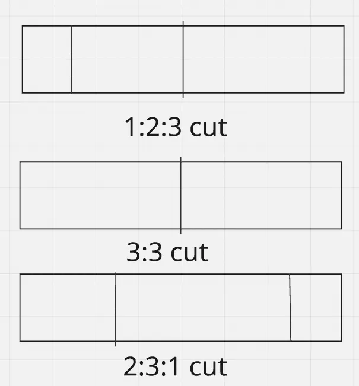

Dynamic Programming is a method to solve problems by combining sub-problems… blah blah blah.

DP is one of those topics I have heard everyone struggle with, from beginners to experts. It’s also one of the topics that can literally span every rating range from 800 to 3000+! 🤣

So, with that said, I believe that DP should have only one rule:

**Never calculate anything twice.**

With that, let’s go over some common ways DP shows up in problems.

---

## 1. Look Back / Look Ahead

**Idea:**
* If it’s trivial like `dp[0]` or `dp[N]`, return a value in $O(1)$.
* Fetch the values of adjacent indices that are just ahead ($i+1$, $i+2$, ...) or just behind ($i-1$, $i-2$) and add some variable or constant to it in $O(1)$.

Thus, if we process the indices in a specific order, for each index we can calculate the value in $O(1)$. Making the overall calculation be $O(N)$, where $N$ is the size of the input array.

### Example 1: Fibonacci
The classic Fibonacci problem: $f(0) = 0$, $f(1) = 1$, while for all $n \ge 2$, $f(n) = f(n-1) + f(n-2)$.
The solution to this is trivial. Just create an array of size $N + 1$, set `a[0] = 0`, `a[1] = 1`, then run a loop from $i = 2$ to $i = N$, setting `a[i] = a[i-1] + a[i-2]`.

### Example 2: Stick Cutting
> Consider you have a very long stick of dimension $1 \times N$. At each step, you can cut off a piece of size $1 \times 1$, $1 \times 2$, or $1 \times 3$ from the end. How many different ways can you completely cut the stick? Two arrangements are considered different if the number of cuts in each is different or if the $i$-th cut in one had a different size from the $i$-th cut in the other. Since the answer may be very large, output it modulo $10^9 + 7$.



Here let us define `dp[i]` as the number of possible arrangements with the first $i$ units of the stick not touched. It is trivial to see that we want `dp[0]`, i.e., the entire stick is processed. It is also trivial to see that `dp[N] = 1`, as there is a single possibility (doing nothing when length is 0). 

Now if we want to calculate for `dp[i]`:
* We can process sticks till ahead of $i + 1$ units, then cut a $1 \times 1$ unit.
* Same for $i + 2$ and $i + 3$.

Thus:
* If $i > N$, `dp[i] = 0`
* If $i == N$, `dp[i] = 1`
* Else `dp[i] = (dp[i+1] + dp[i+2] + dp[i+3]) \pmod{10^9 + 7}`

We can see that there is no over-counting happening here. Suppose you say that to go from $i + 3$ to $i$, we can also cut a $1 \times 2$ first and then a $1 \times 1$. But that is already covered in going from $i + 1$ to $i$. So our formula stands correct!

**How to identify such a pattern:**
* Value of input array is usually between $10^5$ to $10^6$.
* We want `dp[0]` / `dp[N]` and `dp[N]` / `dp[0]` is fixed per testcase.
* Write small test cases to figure out possible relations.

---

## 2. Knapsack Variants

The Knapsack problem is a standard DP problem that can be defined as:
* You have a "bag" of size $W$.
* You have "items", each with a respective weight $w_i$, and optionally a value $v_i$.
* You can either take an item or not take it.
* Sum of all taken items should be $\le W$.
* Find the maximum sum of values under this constraint / find the number of ways to make a sum of weights / find if achieving a sum of weights is possible.

For simplification, we deal with 2 types of knapsack:

### A. Finite frequency of items
Here each item can be used 1 or more times, but only finitely. Let's first consider the case where each item has a weight and a value, all the weights are unique, and we have to find the maximum sum of values obtainable.

```python
def knapsack(items: list[tuple[int]], W: int) -> int:
    # initialise with zeroes
    dp = (W + 1) * [0]
    for w, v in items:
        # iterate in [w, W] in reverse
        for i in reversed(range(w, W + 1)):
            dp[i] = max(dp[i], dp[i-w] + v)
    # make sure to return max value, not dp[-1]
    return max(dp)
```

Now if we have an item $(w_i, v_i)$ that has some frequency $f_i$, then repeatedly running the inner loop for the same item can be unnecessary. We can make an optimization here (Binary Lifting). Let’s take an example:
Consider $w_i = 3$, $v_i = 5$, $f_i = 10$.
So I can take the item once for weight 3 and value 5, or twice for weight 6 and value 10, or even 7 times for weight 21 and value 35!

Instead of 10 items, we can group them:
* $w_{i1} = 3$, $v_{i1} = 5$ (frequency 1)
* $w_{i2} = 6$, $v_{i2} = 10$ (frequency 2)
* $w_{i3} = 12$, $v_{i3} = 20$ (frequency 4)
* $w_{i4} = 9$, $v_{i4} = 15$ (frequency 3 - the remainder)

The sum of all weights = $3 + 6 + 12 + 9 = 30 = 3 \times 10$.
Now if we individually do 4 iterations with these weights, we can cover all the possibilities that are possible by 10 iterations of the original item!
This is because any $k \le 10$ can be made with a combination of these 4 weights.
* $k = 7 \rightarrow 1 + 2 + 4 = 7$
* $k = 8 \rightarrow 1 + 4 + 3 = 8$
* $k = 3 \rightarrow 1 + 2 = 3$

The pattern is quite simple: we can use powers of 2 to build any frequency, and then add an extra buffer frequency as needed.

```python
def knapsack(items: list[tuple[int]], W: int) -> int:
    # initialise with zeroes
    dp = (W + 1) * [0]
    for w, v, f in items:
        factor = 1
        while f > 0:
            multiplier = min(factor, f)
            w_, v_ = multiplier * w, multiplier * v
            # iterate in [w_, W] in reverse
            for i in reversed(range(w_, W + 1)):
                dp[i] = max(dp[i-w_] + v_, dp[i])
            f -= multiplier  # Corrected line
            factor *= 2
    return max(dp)
```

### B. Infinite supply
Consider you have an unlimited supply of coins of certain denominations (coins of 2, 5, 10, etc). Find out the number of ways you can make a given amount.
This is a classic Leetcode Problem (518. Coin Change II). For this, there is just one change to our initial logic: **Reverse the inner loop!**

*Proof of correctness:* Consider if I want to add a coin of denomination $k$ to an amount $x$ to make it $y$. If I process $y$ after $x$, I must have ensured that I have used the maximum possible amount of $k$ type coins. For $x = k$, this is trivial as you can only use a single coin to get that amount. By induction, it gets proven true for all $x > k$.

```python
def change(self, amount: int, coins: List[int]) -> int:
    dp = (amount + 1) * [0]
    # not taking anything is a single possibility
    dp[0] = 1
    for c in coins:
        # range is reverse of our finite case
        for i in range(c, amount + 1):
            dp[i] += dp[i-c]
    return dp[amount]
```

*(BTW, a more detailed tutorial on CP algorithms for Knapsack variants can be found here: [cp-algorithms.com/dynamic_programming/knapsack.html](https://cp-algorithms.com/dynamic_programming/knapsack.html))*

**How to identify such a pattern:**
* Value of input array is usually between $10^3$ to $5 \times 10^3$.
* You have to maximize some value obtained from a subset of the input under constraints.
* "Take — not take" variants generally appear.

[Link to C++ codes for knapsack](https://onlinegdb.com/cMZO0j-Xu)
[Local file: ](../static/code_files/knapsack.cpp)

---

## 3. Sub-sequence DP

Consider this problem:
> Given an array of $N$ integers, find the maximum sum of a subsequence where the adjacent elements are coprime. More formally, we have an array $A$ of $N$ integers. Consider a set of indices $1 \le i_1 < i_2 < \dots < i_k \le N$, where $1 \le k \le N$, such that for all $j$ in $[1, k)$, $\gcd(A[i_j], A[i_{j+1}]) = 1$. Find the maximal sum of any such set.

The idea for this is that we define `dp[i]` as the maximal sum of any sub-sequence that fulfills the condition and its last index is $i$. If we want to take the $i$-th element, we can choose a sub-sequence ending at some $j < i$, where $\gcd(A[j], A[i]) = 1$. Thus for each $i$ from $1$ to $N$, we check for all $j < i$, and if the condition is satisfied, we set `dp[i] = max(dp[i], dp[j] + A[i])`. And `dp[i]` has a default value of $A[i]$, i.e., only choosing that element (if no valid predecessor exists).

The more general version of this problem that usually appears is:
*Find the maximum value (sum, product, etc.) over all sub-sequences of an array satisfying some condition $X$, and checking whether adding an element to the sub-sequence keeps it valid depends on the last element of the original sub-sequence.*

**General algorithm for this ($O(N^2)$ time complexity):**
1. Iterate from $i = 1$ to $i = N$, where $N$ is the length of the array.
2. For each $i$, let `dp[i]` = value of taking just the $i$-th element.
3. Iterate for all $j < i$, and check whether adding the $i$-th element after the $j$-th element forms a valid sub-sequence. If yes, update the value of `dp[i]`.
4. Return the maximum of `dp[i]` over all $i$.

**Another problem:**
> Count all non-empty sub-sequences of an array of integers that are strictly increasing.

Here, it is trivial to see that any two sub-sequences that end at two different indices $i$ and $j$ ($i \neq j$) are different. So if we just found `dp[i]` = number of sub-sequences with the last index as $i$, and sum over $1 \le i \le N$, we get the required answer.

The solution algorithm ($O(N^2)$) is something like:
1. Iterate from $i = 1$ to $i = N$. Initialise `dp[i] = 1` (single element sub-sequence).
2. For each $j = 1$ to $j = i - 1$, add `dp[j]` to `dp[i]` if $A[i] > A[j]$.
3. Return sum of all `dp` array.

**How to identify such a pattern:**
* Value of input array is usually between $10^3$ to $5 \times 10^3$. Sometimes harder versions which may use concepts from range queries have higher constraints.
* Optimal sub-sequence under some conditions.
* Sometimes it is related to counting all sub-sequences that satisfy a condition.
* Constraints allow for $O(N^2)$ approaches.

---

## Practice Problems

Here are some awesome DP problems you can practice on Codeforces!

1. [CF 2031 A - Penchick and Modern Monument](https://codeforces.com/problemset/problem/2031/A)
2. [CF 2126 B - No Casino in the Mountains](https://codeforces.com/problemset/problem/2126/B)
3. [CF 2178 B - Impost or Sus](https://codeforces.com/problemset/problem/2178/B)
4. [CF 2225 C - Red-Black Pairs](https://codeforces.com/problemset/problem/2225/C)
5. [CF 2064 C - Remove the Ends](https://codeforces.com/problemset/problem/2064/C)
6. [CF 2229 C2 - We Be Flipping (Hard Version)](https://codeforces.com/problemset/problem/2229/C2)
7. [CF 2233 C - Cost of a Bracket Sequence](https://codeforces.com/problemset/problem/2233/C)
8. [CF 2242 D - Two Digit Strings](https://codeforces.com/problemset/problem/2242/D)
9. [CF 2037 E - Kachina’s Favourite Binary String](https://codeforces.com/problemset/problem/2037/E)
10. [CF 2230 D - Good Schedule](https://codeforces.com/problemset/problem/2230/D)

---

That’s all for now! DP is a much, much vast topic, so I have to cover more of it soon, but till then keep coding!
